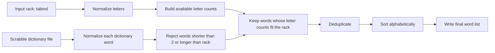

# TABIND Scrabble Project

This project solves one focused data science assignment:

> Take the letter combination `tabind` one time and create an alphabetical list of every Scrabble-valid word that can be formed from those letters.

The implementation uses a small, documented Python program and a GitHub Pages-ready documentation page. The sample result was verified on 2026-06-08 against the Free Scrabble Dictionary word finder, which states that its results come from the NASPA Word List 2023, the official North American Scrabble tournament dictionary.

## Final Alphabetical Output

The verified `tabind` result contains 51 words:

```text
ab
ad
adit
ai
aid
ain
ait
an
and
ani
ant
anti
at
ba
bad
bait
ban
band
bandit
bani
bat
bi
bid
bin
bind
bint
bit
da
dab
dan
dib
din
dint
dit
dita
id
in
it
na
nab
nib
nit
ta
tab
tabid
tad
tain
tan
ti
tian
tin
```

## Method

The checklist requested Mermaid documentation and dbdiagram ERD documentation. Both are included here and on the GitHub Pages site.



## ERD for dbdiagram

The program does not require a database, but this DBML model documents the data entities used in the pipeline. It can be pasted into [dbdiagram.io](https://dbdiagram.io/).

```dbml
Table source_dictionary {
  id integer [primary key]
  name varchar
  version varchar
  source_url varchar
}

Table candidate_word {
  id integer [primary key]
  source_dictionary_id integer
  raw_text varchar
  normalized_text varchar
  is_alpha boolean
}

Table result_word {
  id integer [primary key]
  candidate_word_id integer
  rack varchar
  word varchar
  length integer
  scrabble_score integer
}

Ref: candidate_word.source_dictionary_id > source_dictionary.id
Ref: result_word.candidate_word_id > candidate_word.id
```

The same ERD is saved as [`docs/tabind_erd.dbml`](docs/tabind_erd.dbml).

## Run Locally

The project is dependency-free and can be run with standard Python:

```bash
python src/tabind_solver.py
```

With `uv`, as recommended in the checklist:

```bash
uv run python src/tabind_solver.py
```

To use a full Scrabble dictionary, provide a text file with one word per line:

```bash
python src/tabind_solver.py path/to/scrabble_dictionary.txt --letters tabind --output data/my_tabind_results.txt
```

## Test

```bash
python -m unittest discover -s tests
```

The tests verify that the solver:

- uses each rack letter at most once
- deduplicates repeated dictionary entries
- ignores punctuation and non-alpha entries
- returns words in alphabetical order


## Sources

- Free Scrabble Dictionary Scrabble Word Finder: https://www.freescrabbledictionary.com/scrabble-word-finder/?letters=tabind
- Free Scrabble Dictionary states that results come from NASPA Word List 2023: https://www.freescrabbledictionary.com/scrabble-word-finder
- Official Scrabble Players Dictionary word finder by Merriam-Webster: https://scrabble.merriam.com/
- Mermaid documentation: https://mermaid.js.org/
- dbdiagram: https://dbdiagram.io/
