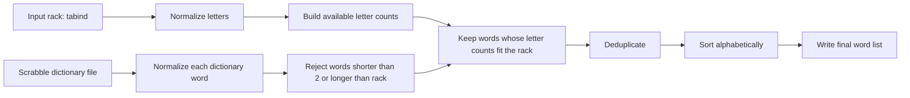

# TABIND Scrabble Project

This project solves one focused data science assignment:

> Take the letter combination `tabind` one time and create an alphabetical list of every Scrabble-valid word that can be formed from those letters.

The implementation uses a small, documented Python program and a GitHub Pages-ready documentation page. The program reads a full Scrabble dictionary file, then finds only the words that can be built from `tabind` while using each character no more than once. The bundled dictionary is `data/scrabble_dictionary.txt`, sourced from Richard Ressler's Scrabble Word List dataset.

## Final Alphabetical Output

Using the bundled full Scrabble word list in `data/scrabble_dictionary.txt`, the `tabind` result contains 65 words:

```text
ab
abid
ad
adit
ai
aid
ain
ait
an
and
ani
ant
anti
at
ba
bad
bait
ban
band
bandit
bani
bant
bat
bi
bid
bin
bind
bint
bit
da
dab
daint
dan
dant
di
dib
din
dint
dit
dita
id
idant
in
it
ita
na
nab
nat
nib
nid
nit
ta
tab
tabi
tabid
tad
tai
tain
tan
ti
tian
tid
tin
tina
tind
```

## Method

The checklist requested Mermaid documentation and dbdiagram ERD documentation. Both are included here and on the GitHub Pages site.



## ERD for dbdiagram

The program does not require a database, but this DBML model documents the data entities used in the pipeline. It can be pasted into [dbdiagram.io](https://dbdiagram.io/).

```dbml
Table source_dictionary {
  id integer [primary key]
  name varchar
  version varchar
  source_url varchar
}

Table candidate_word {
  id integer [primary key]
  source_dictionary_id integer
  raw_text varchar
  normalized_text varchar
  is_alpha boolean
}

Table result_word {
  id integer [primary key]
  candidate_word_id integer
  rack varchar
  word varchar
  length integer
  scrabble_score integer
}

Ref: candidate_word.source_dictionary_id > source_dictionary.id
Ref: result_word.candidate_word_id > candidate_word.id
```

The same ERD is saved as [`docs/tabind_erd.dbml`](docs/tabind_erd.dbml).

## Run Locally

The project is dependency-free and includes a full Scrabble word list at `data/scrabble_dictionary.txt`. Run:

```bash
python src/tabind_solver.py
```

With `uv`, as recommended in the checklist:

```bash
uv run python src/tabind_solver.py
```

You can also provide another full Scrabble dictionary path explicitly:

```bash
python src/tabind_solver.py path/to/scrabble_dictionary.txt --letters tabind --output data/my_tabind_results.txt
```

The repository also includes `data/sample_scrabble_dictionary.txt` only as a small test/demo fixture. The program default is the full dictionary file, not the sample.

## Test

```bash
python -m unittest discover -s tests
```

The tests verify that the solver:

- uses each rack letter at most once
- reads candidate words from a dictionary file
- deduplicates repeated dictionary entries
- ignores punctuation and non-alpha entries
- returns words in alphabetical order


## Sources

- Richard Ressler Scrabble Word List dataset: https://rressler.quarto.pub/i_data_sets/data_word_lists.html
- Bundled full dictionary source file: https://raw.githubusercontent.com/rressler/data_raw_courses/main/scrabble_words.txt
- Official Scrabble Players Dictionary word finder by Merriam-Webster: https://scrabble.merriam.com/
- Mermaid documentation: https://mermaid.js.org/
- dbdiagram: https://dbdiagram.io/
