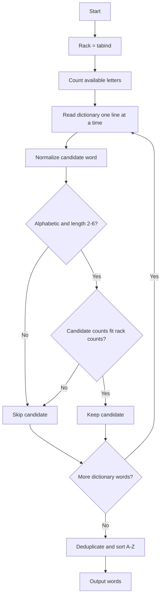

# Methodology

## Project Understanding

The assignment asks for a program that takes the exact letter rack `tabind` and returns every Scrabble dictionary word that can be made from that rack. Each input letter can be used no more than once.

## Data Source

The program accepts a Scrabble dictionary as a plain text file with one word per line. This keeps the solver independent from one copyrighted dictionary distribution. The included sample dictionary demonstrates the method and includes the verified NWL 2023 `tabind` output plus several nonmatching Scrabble words.

## Algorithm

1. Normalize the rack to lowercase alphabetic letters.
2. Read each candidate word from the dictionary.
3. Normalize each candidate word.
4. Reject blank, punctuation, one-letter, or too-long entries.
5. Count the letters in the rack and in the candidate word.
6. Keep the candidate only when every candidate letter count is less than or equal to the matching rack count.
7. Deduplicate matches.
8. Sort the final result alphabetically.

## Mermaid Workflow

## Complexity

Let `n` be the number of dictionary entries and `m` be the maximum candidate word length. The algorithm is `O(n * m)` because it counts each candidate word once. For this assignment, `m` is at most 6 after filtering.
